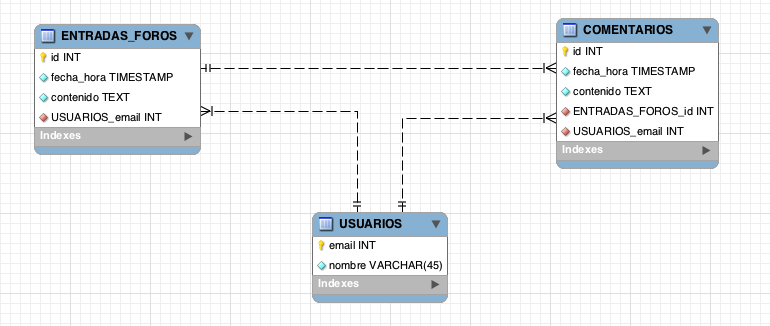

###Escuela Colombiana de Ingeniería
###Procesos de desarrollo de Software - PDSW
####Tecnologías de persistencia - Frameworks de Persistencia - Introducción a MyBatis

## Partes II y III: Avance para el martes en clase.


En este laboratorio, se realizará el mismo ejercicio desarrollado semanas atrás con JDBC 'plano', pero esta vez haciendo uso de un 'framework' de persistencia. La base de datos que se utilizará tiene los siguientes parámetros:

	host: desarrollo.is.escuelaing.edu.co
	puerto: 3306
	usuario: bdprueba
	pwd: bdprueba
	base de datos: bdprueba



##Parte I

1. Ubique los archivos de configuración para producción y pruebas (usando la base de datos H2) de MyBATIS (mybatis-config.xml/mybatis-config-h2.xml). Éste está en la ruta donde normalmente se ubican los archivos de configuración de aplicaciones montadas en Maven (src/main/resources). Edítelos y agregue en éste, después de la sección &lt;settings&gt; los siguientes 'typeAliases':

	```xml
    <typeAliases>
        <typeAlias type='edu.eci.pdsw.samples.entities.EntradaForo' alias='EntradaForo'/>
        <typeAlias type='edu.eci.pdsw.samples.entities.Comentario' alias='Comentario'/>
        <typeAlias type='edu.eci.pdsw.samples.entities.Usuario' alias='Usuario'/>
    </typeAliases>             
```

2. Lo primero que va a hacer es configurar un 'mapper' que permita que el framework construya el grafo de objetos correspondiente a todas las entradas de foro disponibles. Para hacer más eficiente la reconstrucción, la misma se realizará a partir de una sola sentencia SQL que relaciona las entradas de foro, los comentarios, y sus respectivos autores. Ejecute esta sentencia en un cliente SQL (en las estaciones Linux está instalado EMMA), y revise qué nombre se le está asignando a cada columna del resultado:

	```sql
	select ef.id, ef.fecha_hora, ef.contenido, cm.id as id, cm.fecha_hora as fecha_hora, cm.contenido as contenido, autor.nombre as nombre, autor.email as email, autorcom.nombre as nombre,  autorcom.email as email
from ENTRADAS_FOROS as ef 
INNER JOIN COMENTARIOS as cm ON ef.`id` = cm.`ENTRADAS_FOROS_id` 
INNER JOIN USUARIOS as autor ON autor.email=ef.USUARIOS_email
INNER JOIN USUARIOS as autorcom ON autorcom.email=cm.USUARIOS_email
	```

2. Abra el archivo XML en el cual se definirán los parámetros para que MyBatis genere el 'mapper' de EntradaForo (EntradaForoMapper.xml). Ahora, mapee un elemento de tipo \<select> al método 'getEntradaForos':

	```xml
    <select id="getEntradasForo" resultMap="EntradaForoResult">
select ef.id, ef.fecha_hora, ef.contenido, cm.id as id, cm.fecha_hora as fecha_hora, cm.contenido as contenido, autor.nombre as nombre, autor.email as email, autorcom.nombre as nombre,  autorcom.email as email
from ENTRADAS_FOROS as ef 
INNER JOIN COMENTARIOS as cm ON ef.`id` = cm.`ENTRADAS_FOROS_id` 
INNER JOIN USUARIOS as autor ON autor.email=ef.USUARIOS_email
INNER JOIN USUARIOS as autorcom ON autorcom.email=cm.USUARIOS_email
    </select>
	```

3. Note que el mapeo hecho anteriormente, se indica que los detalles de a qué atributo corresponde cada columna del resultado de la consulta están en un 'resultMap' llamado "EntradaForoResult". En el XML del mapeo agregue un elemento de tipo &lt;resultMap&gt;, en el cual se defina, para una entidad(clase) en particular, a qué columnas estarán asociadas cada una de sus propiedades (recuerde que propiedad != atributo). La siguiente es un ejemplo del uso de la sintaxis de &lt;resultMap&gt; para la clase Maestro, la cual tiene una relación 'uno a muchos' con la clase DetalleUno y una relación 'uno a uno' con la clase DetalleDos, y donde -a la vez-, DetalleUno tiene una relación 'uno-a-uno- con DetalleDos:

	```xml
    <resultMap type='Maestro' id='MaestroResult'>
        <id property='propiedad1' column='COLUMNA1'/>
        <result property='propiedad2' column='COLUMNA2'/>
        <result property='propiedad3' column='COLUMNA3'/>  
        <collection property='propiedad4' ofType='DetalleUno'></collection>
		<association property="propiedad5" javaType="DetalleDos"></association>      
    </resultMap>

    <resultMap type='DetalleUno' id='DetalleResult'>
        <id property='propiedadx' column='COLUMNAX'/>
        <result property='propiedady' column='COLUMNAY'/>
        <result property='propiedadz' column='COLUMNAZ'/> 
		 <association property="propiedadw" javaType="DetalleDos"></association>      
    </resultMap>
    
    <resultMap type='DetalleDos' id='DetalleResult'>
        <id property='propiedadr' column='COLUMNAR'/>
        <result property='propiedads' column='COLUMNAS'/>
        <result property='propiedadt' column='COLUMNAT'/>        
    </resultMap>

	```

	Como observa, Para cada propiedad de la clase se agregará un elemento de tipo &lt;result&gt;, el cual, en la propiedad 'property' indicará el nombre de la propiedad, y en la columna 'column' indicará el nombre de la columna de su tabla correspondiente (en la que se hará persistente). En caso de que la columna sea una llave primaria, en lugar de 'result' se usará un elemento de tipo 'id'. Cuando la clase tiene una relación de composición con otra, se agrega un elemento de tipo &lt;association&gt;.Finalmente, observe que si la clase tiene un atributo de tipo colección (List, Set, etc), se agregará un elemento de tipo &lt;collection&gt;, indicando (en la propiedad 'ofType') de qué tipo son los elementos de la colección. En cuanto al indentificador del 'resultMap', como convención se suele utilizar el nombre del tipo de dato concatenado con 'Result' como sufijo.
	
	Teniendo en cuenta lo anterior, haga tres 'resultMap': uno para la clase EntradaForo, otro para la clase Comentario, y otro para la clase Usuario. 

5. Una vez haya hecho lo anterior, es necesario que en el elemento &lt;collection&gt; del maestro se agregue una propiedad que indique cual es el 'resultMap' a través del cual se podrá 'mapear' los elementos contenidos en dicha colección. Para el ejemplo anterior, como la colección contiene elementos de tipo 'Detalle', se agregará el elemento __resultMap__ con el identificador del 'resultMap' de Detalle:

	```xml
	<collection property='propiedad3' ofType='Detalle' resultMap='DetalleResult'></collection>
```

	Teniendo en cuenta lo anterior, haga los ajustes correspondientes en la configuración para el caso del modelo de Pacientes y Consultas.

	
7. Si intenta utilizar el 'mapper' tal como está hasta ahora, se puede presentar un problema: qué pasa si las tablas a las que se les hace JOIN tienen nombres de columnas iguales?... Con esto MyBatis no tendría manera de saber a qué atributos corresponde cada una de las columnas. Para resolver esto, si usted hace un query que haga JOIN entre dos o más tablas, siempre ponga un 'alias' con un prefijo el query. Por ejemplo, si se tiene

	```sql	
	select ma.propiedad1, det.propiedad1 ....
```	

	Se debería cambiar a:

	```sql		
	select ma.propiedad1, det.propiedad1 as detalle_propiedad1
```

	Y posteriormente, en la 'colección' o en la 'asociación' correspondiente en el 'resultMap', indicar que las propiedades asociadas a ésta serán aquellas que tengan un determinado prefijo:


	```xml
    <resultMap type='Maestro' id='MaestroResult'>
        <id property='propiedad1' column='COLUMNA1'/>
        <result property='propiedad2' column='COLUMNA2'/>
        <result property='propiedad3' column='COLUMNA3'/>        
        <collection property='propiedad4' ofType='Detalle' columnPrefix='detalle_'></collection>
    </resultMap>
```
	Haga los ajustes necesarios en la consulta y en los 'resultMap' para que no haya inconsistencias de nombres (por ejemplo, el correo del autor de la entrada al foro y el del autor del comentario).


8. Use el programa de prueba suministrado (MyBatisExample) para probar cómo a través del 'mapper' generado por MyBatis, se puede consultar un paciente. 

	```java	
...
SqlSessionFactory sessionfact = getSqlSessionFactory();
SqlSession sqlss = sessionfact.openSession();
EntradaForoMapper pedmp=sqlss.getMapper(EntradaForoMapper.class);
System.out.println(pedmp.getEntradasForo());
...
```

9. Con lo anterior, implemente la operación 'loadAll' de MyBATISDAOEntradaForo. Pruebe el funcionamiento de MyBATIS a través del DAO con el ejemplo implementado en DAOUseExample.


##Parte II

Implemente la operación 'load' de MyBATISDaoUsuario. Recuerde que para esto debe:

1. Configurar el 'mapper' para el método _Usuario getUsuario(String email)_ definido en la interfaz UsuarioMapper.
2. Hacer uso del mapper en el DAO correspondiente.

En este caso, a diferencia del ejercicio anterior, el método asociado al 'mapper' tiene parámetros que se deben usar en la sentencia SQL. Es decir, el parámetro 'email' de  _public Usuario getUsuario(String email);_ se debe usar en el WHERE de su correspondiente sentencia SQL. Para hacer esto tenga en cuenta:

1. Agregue la anotación @Param a dicho parámetro, asociando a ésta el nombre con el que se referirá en la sentencia SQL:

	```java
		public Usuario getUsuario(@Param("emailusuario") String email)
	
	```

2. Al XML (\<select>, \<insert>, etc) asociado al método del mapper, agregue la propiedad _parameterType="map"_ .
3. Una vez hecho esto, podrá hacer referencia dentro de la sentencia SQL a este parámetro a través de: #{emailusuario}


## Parte III

Implemente las operaciones:

* save de MyBATISDaoUsuario
* load de MyBATISDaoEntradaForo
* addToForo de MyBATISDaoEntradaForo


## Parte IV
10. Implemente una prueba para la consulta de Entadas de Foro, teniendo en cuenta la siguiente clase de equivalencia: Entradas de Foro que no tienen Comentarios. En caso de que el DAO hecho con MyBATIS tenga problemas, cual es la causa del mismo?. En caso de requerir corregir la sentencia SQL tenga en cuenta el siguiente gráfico:


